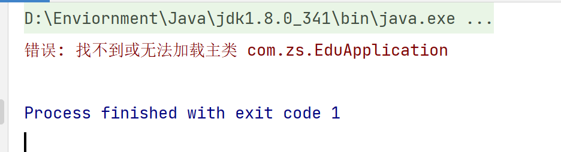
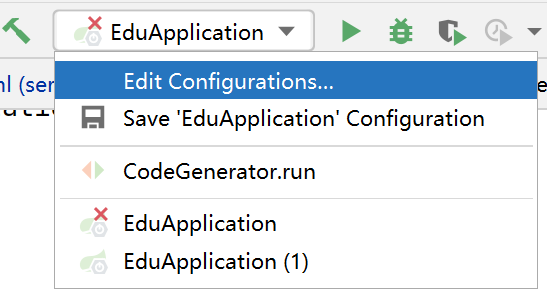
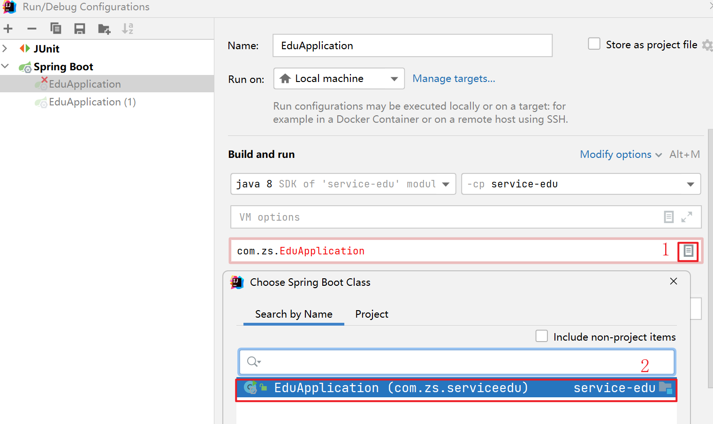
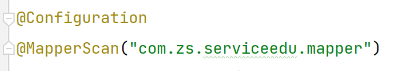

## 1. 找不到或无法加载主类 com.zs.EduApplication

原因：开始创建了一个包为`com.zs`，后面为了统一命名规范，修改为了`com.zs.serviceedu`，其余什么都没有改，紧接着就出现了上面的错误。



解决办法：修改运行的配置，如下





随后，点击apply----> ok即可。

## 2.org.springframework.beans.factory.UnsatisfiedDependencyException错误

部分错误信息：

```shell
org.springframework.beans.factory.UnsatisfiedDependencyException: Error creating bean with name 'eduTeacherController': Unsatisfied dependency expressed through field 'eduTeacherService'; nested exception is org.springframework.beans.factory.UnsatisfiedDependencyException: Error creating bean with name 'eduTeacherServiceImpl': Unsatisfied dependency expressed through field 'baseMapper'; nested exception is org.springframework.beans.factory.NoSuchBeanDefinitionException: No qualifying bean of type 'com.zs.serviceedu.mapper.EduTeacherMapper' available: expected at least 1 bean which qualifies as autowire candidate. Dependency annotations: {@org.springframework.beans.factory.annotation.Autowired(required=true)}
	at org.springframework.beans.factory.annotation.AutowiredAnnotationBeanPostProcessor$AutowiredFieldElement.inject(AutowiredAnnotationBeanPostProcessor.java:639) ~[spring-beans-5.2.1.RELEASE.jar:5.2.1.RELEASE]

```

原因：依赖不满足异常，这里出现了controller、service、mapper，最可能的原因就是==依赖注入有问题==，因此需要查看一下依赖是否注入正确，并且@MapperScan是否正确。最终经过查看，因为重命名了包，但是在此之前已经设置了@MapperScan的包为`com.zs.mapper`，而重命名后正确的应该是`com.zs.serviceedu.mapper`。

解决：修改@MapperScan中的包路径




修改完后，直接运行启动类，就完成了。